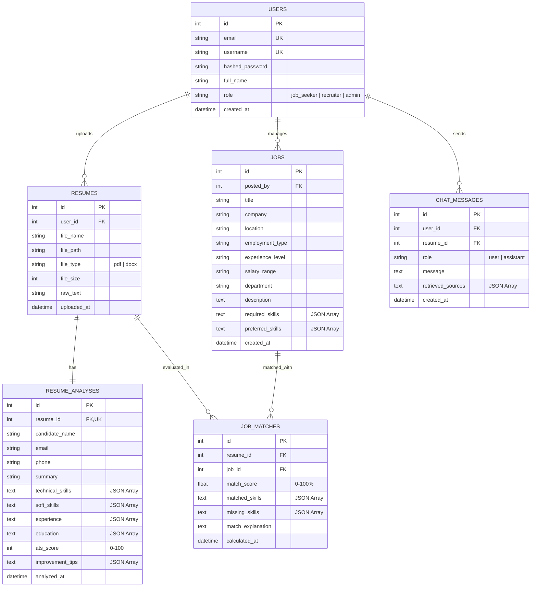

# AI Resume Analyzer & Career Advisor (RAG + AI Agents)

An intelligent, full-stack career platform engineered strictly according to the **Software Requirements Specification (SRS)** using **Python**, **FastAPI**, **SQLite**, and **HTML5/CSS3/Vanilla JavaScript** (without external frontend frameworks).

The system integrates **Autonomous AI Agents** and **Retrieval-Augmented Generation (RAG)** to evaluate candidate resumes, calculate job alignment scores, diagnose skill gaps, and provide actionable career mentoring.

---

## 📋 Features & Functional Requirements Matrix

| Requirement | Module | Implementation |
|---|---|---|
| **FR-1: User Authentication** | `auth_router.py` | Registration, login with PBKDF2 password hashing + salts, secure JWT tokens, session persistence. |
| **FR-2: Resume Upload** | `file_extractor.py` | Upload and parsing of **PDF** and **DOCX** files with mime-type checking, size limits (10MB), and error handling. |
| **FR-3: Resume Analysis** | `resume_agent.py` | Autonomous **Resume Analyzer Agent** extracting candidate details, technical/soft skills, timeline, ATS score, and executive summary. |
| **FR-4: Job Recommendation** | `matching_agent.py` | Autonomous **Job Matching Agent** calculating composite match scores (0-100%), skill matrices, and fit explanations. |
| **FR-5: Resume Improvement** | `advisor_agent.py` | Autonomous **Career Advisor Agent** identifying weaknesses, missing competencies, certifications, and learning roadmaps. |
| **FR-6: Job Management** | `jobs_router.py` | Full CRUD operations (Add, Edit, Delete, View) for job opportunities. |
| **FR-7: Job Search** | `jobs_router.py` | Multi-criteria search and filtering by keyword, location, department, experience level, and required skills. |

---

## 🤖 AI Agents & RAG Architecture

### 1. Autonomous AI Agents
1. **Resume Analyzer Agent**: Parses raw resume text, detects candidate contact info, matches technical skills against a comprehensive taxonomy, classifies soft skills, structures education and experience, and calculates ATS compatibility.
2. **Job Matching Agent**: Evaluates resumes against job specifications. Combines required skill coverage (50%), preferred skill coverage (15%), and TF-IDF semantic cosine similarity (35%) into a normalized 0-100% score with clear explanatory rationale.
3. **Career Advisor Agent**: Diagnoses skill gaps, retrieves relevant roadmaps and certifications from the RAG knowledge base, and powers an interactive career mentoring chat interface.

### 2. Retrieval-Augmented Generation (RAG) Engine
The application indexes 5 structured knowledge collections located in `/knowledge_base`:
1. `job_descriptions.json`: Real-world job roles, responsibilities, and competencies.
2. `skill_descriptions.json`: Taxonomy of technical & soft skills, categories, synonyms, and proficiency benchmarks.
3. `career_roadmaps.json`: Career progression paths (Junior ➔ Mid ➔ Senior ➔ Staff) with key milestone technologies.
4. `learning_resources.json`: Industry certifications (AWS, CKA, DeepLearning.AI, Meta) and vetted courses.
5. `resume_guidelines.json`: ATS best practices, the X-Y-Z achievement formula, power action verbs, and formatting rules.

---

## 🗄️ Database Entity-Relationship (ER) Diagram



---

## 🚀 Getting Started

### 1. Requirements & Prerequisites
- Python 3.10+
- SQLite (built into Python)
- Modern web browser (Chrome, Edge, Firefox, Safari)

### 2. Quick Installation
```bash
# Clone or navigate to the project directory
cd C:\Users\Rana\.gemini\antigravity\scratch\ai_resume_analyzer

# Install dependencies
pip install -r requirements.txt
```

### 3. Run the Application
Launch the single-command runner script:
```bash
python run.py
```

The application will start immediately:
- **Web Interface**: [http://localhost:8000](http://localhost:8000)
- **Interactive Swagger API Docs**: [http://localhost:8000/docs](http://localhost:8000/docs)
- **ReDoc API Specifications**: [http://localhost:8000/redoc](http://localhost:8000/redoc)

---

## 🧪 Demo Accounts & Sample Resumes

### Built-in Demo Credentials
- **Email**: `demo@resume.ai` (or use the one-click *"⚡ Quick Demo Login"* button in the modal)
- **Password**: `password123`

### Pre-Generated Sample Resumes
For testing, 3 realistic resumes are generated in `/sample_resumes`:
1. `sample_software_engineer.docx` (Jordan Miller - Full Stack Engineer)
2. `sample_data_scientist.docx` (Dr. Maya Patel - Data Scientist)
3. `sample_frontend_developer.docx` (Liam Connor - Frontend Web Developer)

You can load them directly via the dashboard sample buttons or upload them through the drag-and-drop zone.

---

## 🧪 Running Automated Tests
Execute the unit and integration test suite:
```bash
python -m unittest tests/test_api.py -v
```
All 5 comprehensive test suites cover:
1. System Health & RAG Indexing
2. User Authentication (Register & Login)
3. Job Management (CRUD) & Filtered Search
4. Resume Upload, Extraction, ATS Scoring, Recommendations, and Improvements
5. Direct RAG Knowledge Base Retrieval
